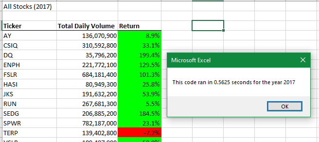
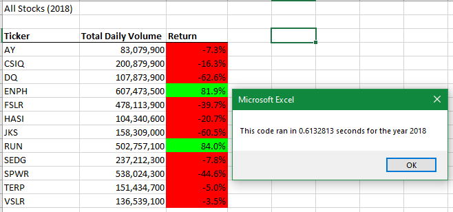
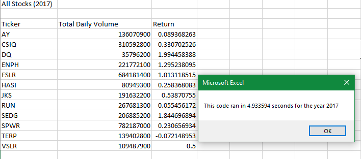

# Analyzing Stocks with VBA
---
## Overview
---
### Purpose
---
<br>
After Steve saved his parents from a bad investment in DQ stocks, he wondered if the dataset were capable of covering more. I refactored the original code to include the entire stock market for analysis over the past couple years. One of my main goals was to make sure the code ran as efficiently as possible even with more to cover. <br>
<br>

---
## Results
---
<br>

### Analysis of Stock Performances
---
<br>
First I'll answer Steve's question about how multiple stocks performed over the last couple years. Please see Figures 1 and 2 below. <br><br>


*Figure 1: Screenshot of finished 2017 stock Excel table upon running refactored code. Column 1 (Ticker) is referring to different stocks. Column 2 shows the amount of stocks moved (bought and sold) within a day. Column 3 shows the percent increase or decrease in value of each stock within the last year.*<br><br>


*Figure 2: Screenshot of 2018 stock Excel table upon running refactored code. Columns same as Figure 1 above.*<br><br>

Clearly, we can see that 2017 was a much better year for the stock market than 2018 was. I'm confident that Steve could apply my code to any stock market year that he needs to, and would advise him to do so. Potentially, he could identify trends that would allow him to better advise, not only his parents, but current and future clients. <br>

### Analysis of Refactored Code
---
<br>
The figures above both include message boxes stating run times for each code. See Figure 3 below for a comparison. <br><br><br>


*Figure 3: Screenshot of 2017 stock analysis with original code (prior to refactoring).*
<br><br>
Notice that my original code took nearly five seconds to run for the 2017 data, and my refactored code was able to run in 0.57 seconds. These screenshots were taken after the code was already run once. That way the code run times were accurately reflected since the computer already had them in their cache. I would also like to note that there is less formatting in the original code. <br>

Let's get into the code refactoring portion a bit deeper. Main difference between the code used for Figures 1 and 2, and the one used in Figure 3 is the subtraction of one `for` loop. The loop that was subtracted had to do with looping through the rows. Instead I replaced it with an added variable. See below:
```
For i = 2 to RowCount
    tickerVolumes(tickerIndex) = tickerVolumes(tickerIndex) + Cells(i, 8).Value

If Cells(i, 1).Value = tickers(tickerIndex) And Cells(i - 1, 1).Value <> tickers(tickerIndex) Then
    tickerStartingPrices(tickerIndex) = Cells(i, 6).Value
End If
```
I was able to repeat that last line of code with minor changes for the ending price column of the dataset. Finally I wrote a line in the code that allowed for the ticker index to increase by one each time the loop would run. This allowed me to cut one of the `for` loops from my original code. 

---
## Summary
---
<p>A major advantage to refactoring code is the drastic reduction in run time. My original code worked well enough for the dataset I was given to work with, but may not have cut it when it came to handling data for thousands of stocks. </p>
<p>One disadvantage to refactoring code is the time potentially spent debugging. It's easy to get lost, so maintaining organization/formatting is key. </p> 